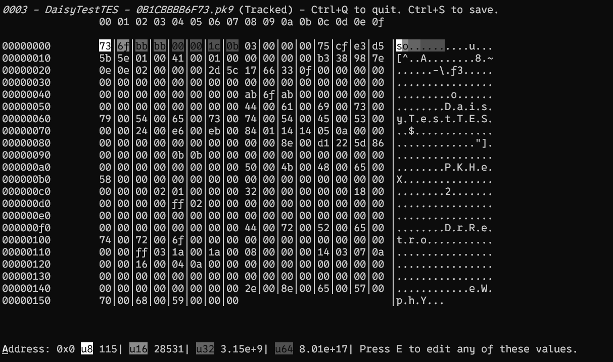

<h1 align="center">Arceus</h1>
<h2 align="center">The modern save manager and editor.</h2>
<h3 align="center"><a href="https://drretros-organization.gitbook.io/arceus/">Documentation</a></h3>

> [!WARNING]
> This is still in alpha.

# What is Arceus?

Arceus designed from the ground up to be the ultimate save manager and editor for every game under the sun! Not just Pokémon!

# Why does it exist?

Arceus was created to be an easier and feature rich save manager that combines elements of both save management and editing into one program. It started as Pokémon Manager and evolved into MudkiPC, which led into the creation of this project.

## Branch Off Into Different Timelines 🌌

With Arceus, you can create branches of your save, so multiple versions of one save can exist simultaneously.

## Rollback to Older Saves 🕔

Arceus allows you to roll back saves to earlier versions, preserving your previous save-data in case you make a mistake.

## Keep track of YOUR saves 👥

Multiple people can play the same game, even if it’s not designed for switching between different players. Just create an user profile!

## Go Beyond with Add-Ons 📦

Arceus integrates Squirrel, enabling anyone to add new functionality to Arceus. Add-ons make it easy to read and write to files, integrate game launchers like Steam, and so much more!
> [!NOTE]
> In the future, I plan to add built-in functionality for easier transfer tool creation, similar to Pokémon Bank. For now, you’ll need to build your own transfer tools.

## Built-In Hex Editor #️⃣

Arceus includes a CLI hex editor you can use to edit saves, view changes, and test plugins!

## Tiny Size 📁

Arceus requires no extra downloads to work, and fits into less than five megabytes!

## Cross Platform 🖥️📱

Arceus can run on any modern device!

## Developer Friendly 🤝

Any developer can use Arceus in their projects, even you! Just remember to give credit if you incorporate it into your project.
> [!NOTE]
> If you want an example of what you can do with Arceus, check out my other project [MudkiPC](https://github.com/Pokemon-Manager/MudkiPC).

# Want to Try?
Click the badge below to download the latest artifact.

> [!WARNING]
> Please keep in mind that Arceus is still in alpha, and it is not 
> opimtized for files larger than a few megabytes.

## Comparison with Other Save Managers:
| Feature | Arceus | [GameSave Manager](https://www.gamesave-manager.com/) | [Ludusavi](https://github.com/mtkennerly/ludusavi) |
| --- | --- | --- | --- |
| Tree Structuring | ✅ | ❌ | ❌ |
| Multi-User Support | ✅ | ❌ | ❌ |
| Save Editing | ✅ | ❌ | ❌ |
| Addon Support | ✅ | ❌ | ❌ |
| Cloud-Sync | ❌ | ✅ | ✅ |
| Open-Source | ✅ | ❌ | ✅ | 
| Integration w/ Steam | ❌ | ✅ | ✅ |
| 

# Planned Features for the Future

## Frontend GUI 🖱️
Create a GUI frontend for Arceus to make it even simpler to use.

## Save on Close ❌
Whenever you close a game, Arceus will grow a star from the current, ensuring you can return to a previous save without lifting a finger.

## Cloud Backups ☁️
Transfer your game saves between devices and keep them safe from data loss.

|Planned | Service |
| --- | --- |
| ✅ Yes| Google Drive |
| ✅ Yes| OneDrive |
| ⚠️ Maybe| Dropbox |
| ⚠️ Maybe| Self-hosted |
| ❌ Unlikely| iCloud |

# Use Cases

## For Save Editors 📝

The main use case for Arceus is for developers wanting to make a save editor. Arceus can be used in save editors to make it easier to focus on what actually matters, the features.

## For Game Development 💻

Easily roll back to any point in your game for testing, provide items for debugging, or intentionally corrupt a save to test edge cases—without writing debug menus! You could even use Arceus as a backend for saving and loading data in any engine.

## For Multiple Players 🫂

Even if a game doesn’t support multiple saves, Arceus can make it easy for multiple players to maintain their own saves.

## For Achievement Hunting 🏆

Jump to specific points in a game to collect achievements without occupying multiple save slots or using quicksaves.

## For Speedrunning 🏃‍➡️

Arceus makes it easier to practice routes, find exploits, and keep your personal saves away from your speedrunning attempts.

## For Mods 🛠️

Keep your modded saves away from your main game saves.

## For Reverse Engineering 📋

Binary files can be challenging to analyze, but Arceus is designed to detect the smallest changes in a file’s history.

# Why is it called Arceus?

The program is named Arceus because Arceus is the "god" of Pokémon and has the ability to affect time and space. It’s also named in connection to my other project, [MudkiPC](https://github.com/Pokemon-Manager/MudkiPC), which is Pokémon-related.

# Consider Sponsoring ❤️

Consider sponsoring me on GitHub to help support this project! If you can’t, no worries—spreading the word about Arceus is equally appreciated. Thank you!
